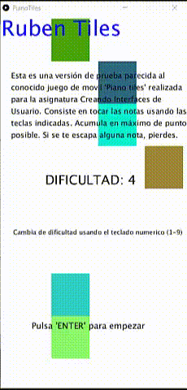

# PianoTiles Práctica 7 CIU

## Rubén García Quintana

## Introducción a la síntesis y procesamiento de audio

### Introducción
- En esta práctica se nos enseña diferentes herramientas para generar sonido, capturar sonido, dibujar las ondas, etc. La tarea final consiste en crear algún prototipo que integrara gráficos y sonido. En mi caso, he obtado por realizar un juego parecido al conocido juego PianoTiles para dispositivos moviles.


- (Aunque en el gif no se aprecie, las teclas están señaladas)
### Desarrollo

- Para la práctica se ha usado, ejemplos y bibliotecas presentados en los videos explicativos y además se han usado hilos para crear las notas que se desplazan.

- Clase para generar el sonido de las notas.

```

class SineInstrument implements Instrument{
  Oscil wave;
  Line  ampEnv;

  SineInstrument( float frequency )
  {
    wave   = new Oscil( frequency, 0, Waves.SINE );
    ampEnv = new Line();
    ampEnv.patch( wave.amplitude );
  }

  void noteOn( float duration )
  {
    ampEnv.activate( duration, 0.5f, 0 );
    wave.patch( nota );
  }

  void noteOff()
  {
    wave.unpatch( nota );
  }
}


```


- En esta clase, nos encargamos de generar el dezplazamiento de los rectangulos que generan los sonidos, y de paso nos ayudamos para saber si hubo colisión.

```


class Tecla {
    String nota;
    boolean flag;
    int y,x,c1,c2,c3,v;
    public Tecla(String nota,int v){
      this.nota=nota;
      c1=87;
      c2=35;
      c3=100;
      y=0;
      this.v=v;
      flag=true;
      switch((int)random(0,3.5)){
        case 0:
              x=10;
        break;
                case 1:
              x=120;
        break;
                case 2:
              x=230;
        break;
                case 3:
              x=340;
        break;
      }

    }
    
  void move(){
   fill(c1,c2,c3);
  rect(x,y,90,100,0);
  y+=v;
    

  }
  
  int getY(){
  return y;
  
  }
    int getX(){
  return x;
  
  }
  
  
  String getSonido(){
    return nota;
  
  }
  
  void setColor(int a,int b,int c){
    if(flag){
      c1=a;
      c2=b;
      c3=c;
      flag=false;
    }
  }
}
```


- Para la generación de las notas hemos creado un ArrayList al cual se le van añadiendo, cada cierta cantidad de frames, más notas musicales. Al realizar mediante la ejecución de un hilo podemos mantener la misma llamada en todo caso y da la sensación de que vienen en fila. Cuando una nota ha sido usada o se ha pasado del limite de altura permitido, se elimina.


### Instrucciones
  - Enter - Empezar/Terminar juego.
  - A | S | D | F | - teclas del piano.
  


